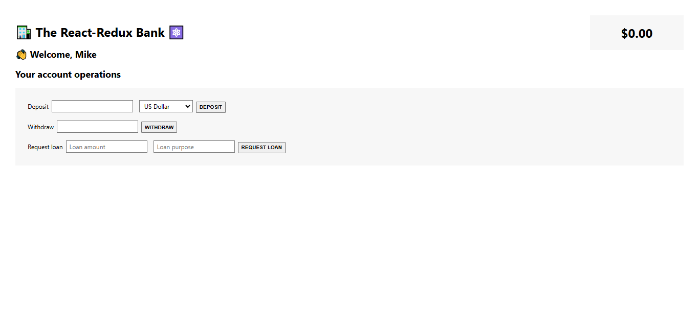

# The Redux Bank Application🏦

The **Redux Bank Application** is a modern banking interface that allows users to manage their accounts and perform essential banking operations seamlessly. This app demonstrates the power of state management using **Redux Toolkit** and provides key features like deposits, withdrawals, loan management, and customer creation, all backed by a robust and clean React architecture.

---

## 📸 Screenshot



## 🔗 Links

- Github Repo: [Github-link](https://github.com/Mikiyas6/The-Redux-Bank)
- Live Site URL: [Page-link](https://mikiyas6.github.io/The-Redux-Bank/)

---

## 🚀 Features

### 💰 Account Operations

- **Deposit Money**: Add funds to your account in multiple currencies (USD, EUR, GBP) with real-time currency conversion.
- **Withdraw Money**: Safely withdraw funds from your account, ensuring you never overdraw.
- **Request a Loan**: Apply for a loan by specifying the amount and purpose, and instantly see it reflected in your account balance.
- **Pay Back Loan**: Pay off your loan if your account balance is sufficient.

### 👥 Customer Management

- **Create New Customer**: Add customers to the system with their full name and National ID, storing the creation date.
- **Update Customer Name**: Modify customer information directly from the application.

### 🔧 Technical Highlights

- Utilizes **Redux Toolkit** for simplified and scalable state management.
- Implements **asynchronous actions** for real-time currency conversion.
- Clean and modular React components for reusability and clarity.

---

## 🛠️ Tech Stack

- **Frontend**: React (with hooks for state and side effects)
- **State Management**: Redux Toolkit
- **API Integration**: Frankfurter API for currency conversion
- **Styling**: Minimal CSS (ready for further enhancement)

---

## 📂 Project Structure

```plaintext
src/
├── features/
│   ├── accounts/
│   │   ├── accountSlice.js  // Manages account-related state
│   │   └── AccountOperations.js  // Component for account actions
│   ├── customers/
│       ├── customerSlice.js  // Manages customer-related state
│       └── createCustomer.js  // Component for creating customers
├── store.js  // Centralized Redux store
└── App.js  // Main application entry point
```

---

## ⚙️ Installation & Setup

1. **Clone the Repository**

   ```bash
   git clone https://github.com/Mikiyas6/The-Redux-Bank.git
   cd redux-bank
   ```

2. **Install Dependencies**

   ```bash
   npm install
   ```

3. **Run the Application**
   ```bash
   npm start
   ```
   The application will be available at [http://localhost:3000](http://localhost:3000).

---

## 🧑‍💻 Usage Guide

### Deposit Money

1. Enter the deposit amount.
2. Select the desired currency.
3. Click **Deposit** to see the updated balance.

### Withdraw Money

1. Enter the withdrawal amount.
2. Click **Withdraw** to deduct funds from the account.

### Request Loan

1. Enter the loan amount and purpose.
2. Click **Request Loan** to add the loan amount to your account balance.

### Pay Loan

1. Ensure your balance is sufficient.
2. Click **Pay Loan** to settle the outstanding loan.

### Create Customer

1. Enter the customer's full name and National ID.
2. Click **Create New Customer** to save the customer information.

---

## 🌐 API Integration

- **Frankfurter API**: Enables real-time currency conversion for deposit operations.

---

## 🎨 Future Improvements

- Add comprehensive styling with a library like **Material UI** or **TailwindCSS**.
- Implement authentication for user accounts.
- Extend functionality to include transaction history.
- Enhance the UI/UX for a more polished user experience.

---

## 🤝 Contribution Guidelines

Contributions are welcome! If you'd like to contribute:

1. Fork the repository.
2. Create a feature branch.
3. Commit your changes.
4. Open a pull request.

---

## 🙌 Acknowledgments

- **Redux Toolkit** for simplifying state management.
- **Frankfurter API** for seamless currency conversion.
- The open-source community for inspiration and support.
